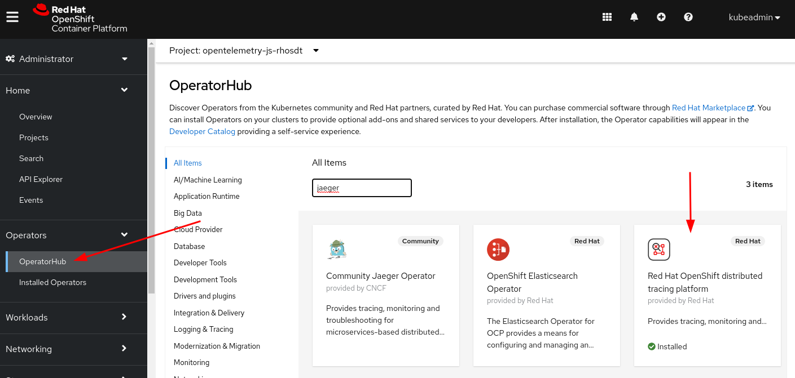
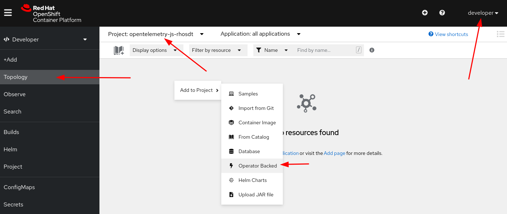
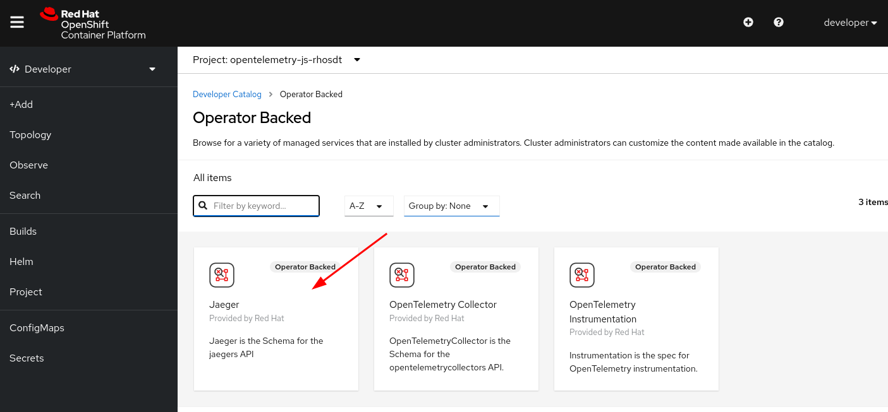
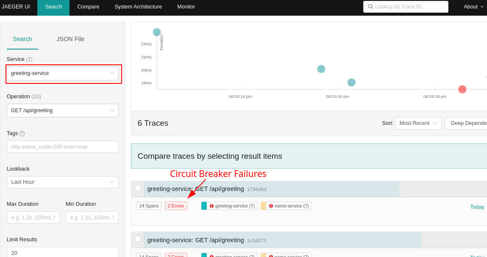
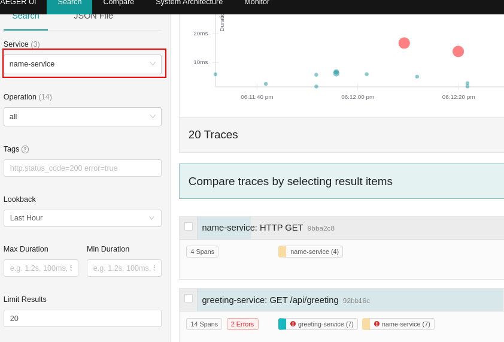

## OpenTelemetry with OpenShift Distributed Tracing Platform

Start OpenShift local and create a new project.

```
$ crc setup
$ crc start
$ eval $(crc oc-env)
$ oc login -u developer
$ oc new-project opentelemetry-js-rhosdt
```
### Install the OpenShift Distributed Tracing Platform Operator

1. Login as kubeadmin
2. Go to OperatorHub
3. Search for Jaeger
4. Click on `Red Hat OpenShift distributed tracing platform` and follow the instructions to install.



5. Login as developer, go to Topology and add the Jaeger Operator to the project.






6. Configure the URL for the JaegerExporter endpoint

```
❯ oc get svc
NAME                                            TYPE        CLUSTER-IP     EXTERNAL-IP   PORT(S)                                                    AGE
jaeger-all-in-one-inmemory-agent                ClusterIP   None           <none>        5775/UDP,5778/TCP,6831/UDP,6832/UDP                        2m16s
jaeger-all-in-one-inmemory-collector            ClusterIP   10.217.5.57    <none>        9411/TCP,14250/TCP,14267/TCP,14268/TCP,4317/TCP,4318/TCP   2m16s
jaeger-all-in-one-inmemory-collector-headless   ClusterIP   None           <none>        9411/TCP,14250/TCP,14267/TCP,14268/TCP,4317/TCP,4318/TCP   2m16s
jaeger-all-in-one-inmemory-query                ClusterIP   10.217.5.219   <none>        443/TCP,16685/TCP                                          2m16s
```

We are going to use `jaeger-all-in-one-inmemory-collector` + 
our namespace service `opentelemetry-js-rhosdt.svc` for the
 `JaegerExporter` endpoint. 
 
Resulting in the following:

```js
const exporter = new JaegerExporter({
  endpoint: 'http://jaeger-all-in-one-inmemory-collector.opentelemetry-js-rhosdt.svc:14268/api/traces'
});
```

7. Deploy the example to OpenShift local

* Uncomment the `require('./tracing.js');` on `greeting-service/app.js`
* Uncomment the `require('./tracing.js');` on `name-service/app.js`

```
cd greeting-service
npm install
npm run openshift
cd ../name-service
npm install
npm run openshift
```

8. When you login on Jaeger UI you can see the result like this:




